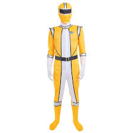
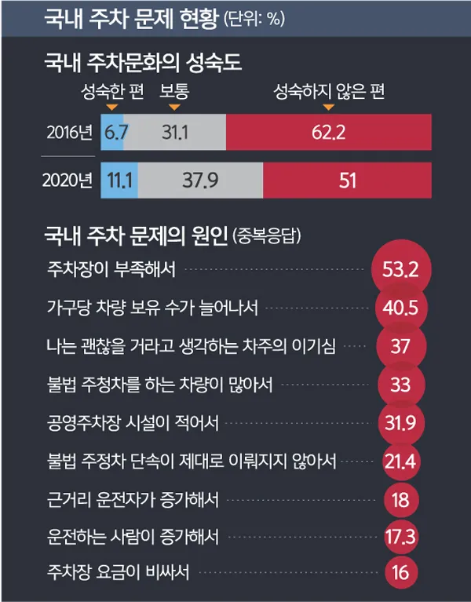
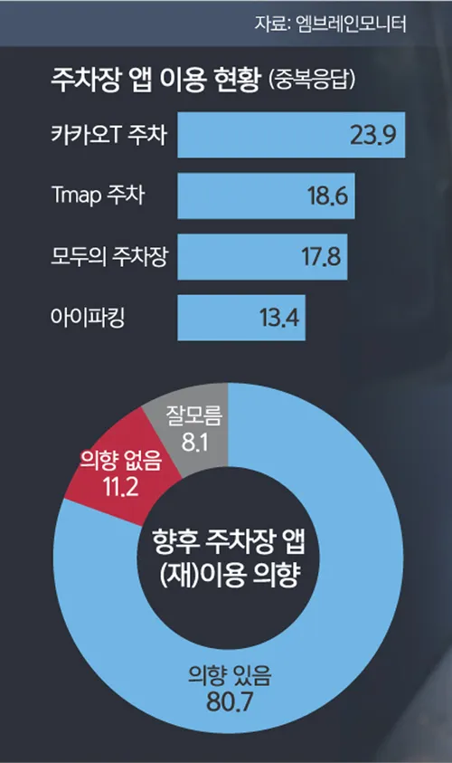
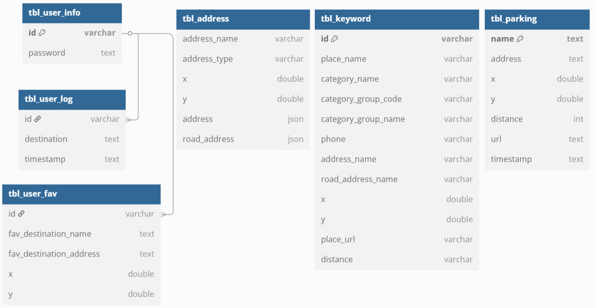

# 🚗 목적지 주변 주차장 검색 서비스 🚗

## 팀명
### **주차장 찾아조!**

## 팀원 소개
| 팀장                                                                                                                                                                                            | 팀원                                                                                                                                                                                               | 팀원                                                                                                                                                                                                   | 팀원                                                                                                                                                                                                   | 팀원                                                                                                                                                                                                    |
|-----------------------------------------------------------------------------------------------------------------------------------------------------------------------------------------------|--------------------------------------------------------------------------------------------------------------------------------------------------------------------------------------------------|------------------------------------------------------------------------------------------------------------------------------------------------------------------------------------------------------|------------------------------------------------------------------------------------------------------------------------------------------------------------------------------------------------------|-------------------------------------------------------------------------------------------------------------------------------------------------------------------------------------------------------|
|    하종수  |    강윤구  |    이승혁  |    이재혁  |    이원지희  |
| System Integrator                                                                                                                                                                             | Fetching                                                                                                                                                                                         | Fetching                                                                                                                                                                                             | UI / FE                                                                                                                                                                                              | Database                                                                                                                                                                                              |

## :memo:목차
- 프로젝트 개요
- 프로젝트 구성
- 주요 기능 설명
- 서비스 화면 구성
- 데이터 관리 (ERD)
- 수행 결과
- 팀원 별 회고

## 1. 프로잭트 개요
### 1.1 프로젝트 소개
- 내가 지정한 목적지(주소 또는 키워드) 근처의 주차장과 주차장의 정보를 제공하는  서비스 개발
- 사용자가 목적지 근처의 주차장을 검색할 수 있고, 그 주차장의 요금 정보를 파악할 수 있음

### 1.2. 동기
- 도심 지역에서 주차 공간 부족으로 인한 운전자 스트레스 증가
- 목적지에 도착해도 주차장을 찾아 추가 이동해야 하는 불편
- 주차 공간을 찾기위한 시간, 연료 낭비 발생
- 목적지 주변의 추차장을 빠르게확인할 수 있다면 사용자 편의성 향상 가능
- 실시간 정보를 기반으로 한 스마트한 주차장 탐색 서비스 필요성 인식

### 1.3. 관련 뉴스 기사

    
    

https://www.segye.com/newsView/20210111513455

### 1.4 프로젝트 목표
- 빠르고 편리한 주차장 검색 경험 제공
- 실시간 정보 기반 신뢰성 높은 서비스 구축

## 2. 프로젝트 구성
### 2.1. 기술 스택
| 분류      | 기술                                                                                                                                                                                                                                   |
|---------|--------------------------------------------------------------------------------------------------------------------------------------------------------------------------------------------------------------------------------------|
| 언어      |                                                                                                                                |
| 데이터 수집  |                                                                                                                         |
| 데이터저장   |                                                                                                                                  |
| 데이터 시각화 |                                                                                                                                |
| 화면구현    |   |

### 2.2. 기능적 요구사항
|ID|요구사항 설명|
|------|---|
|FR-01|사용자는 목적지 주소 또는 키워드를 입력할 수 있어야 함|
|FR-02|시스템은 입력된 목적지를 기준으로 주변 주차장을 검색해야 함|
|FR-03|검색된 주차장의 위치(지도 표시)와 상세정보(요금, 운영시간)을 제공해야함|
|FR-04|사용자는 주차장 거리 기준으로 정렬할 수 있어야 함|
|FR-05|사용자는 주차장 세부 정보를 클릭해 상세 페이지(요금표, 운영시간 등)을 확인할 수 있어야 함|
|FR-06|시스템은 사용자가 과거 검색한 기록(최근 검색)을 저장하고 추천할 수 있어야함|

### 2.3. 비기능적 요구사항
|ID|요구사항 설명|
|------|---|
|NFR-01|서비스 화면은 직관적이고 사용자가 쉽게 조작할 수 있어야 함|
|NFR-02|검색 결과는 3초 이내에 사용자에게 표시되어야 함|
|NFR-03|사용자 개인정보(검색 기록, 즐겨찾기 등)은 암호화 저장되어야 함|
|NFR-04|지도 및 주차장 상세정보는 항상 최신 상태를 유지해야 함|

## 3. 주요 기능 설명
### 3.1. 데이터 수집 및 관리
- 카카오 REST API를 사용하여 목적지(주소 또는 키워드)를 좌표(위도/경도)로 변환
- 변환된 좌표를기준으로 근처 주차장 데이터 검색
- 사용자 요청에 따라 실기간으로 주차장 데이터 수집
- 사용자의 요청 기록 데이터는 일괄 CSV파일로 저장
- 기록 데이터 수집과 동시에 MySQL DB로 연동하여 관리
- 기본 정보(주차장명, 주소, 좌표, 운영시간) 수집
- 가격 정보(기본요금, 추가요금) 수집

### 3.2. 주차장 검색 및 지도 표시
- 전국의 주차장 검색 가능
- 지도에 목적지 근처 주차장 위치 표시
- 목적지와의 거리 오름차순 정렬

## 4. 서비스 화면 구성

## 5. 데이터 관리 (ERD)

## 팀원 프로젝트 회고
| 이름 | 회고 |
|------|------|
| **종수** | |
| **윤구** | |
| **승혁** | |
| **재혁** | |
| **지희** | |
